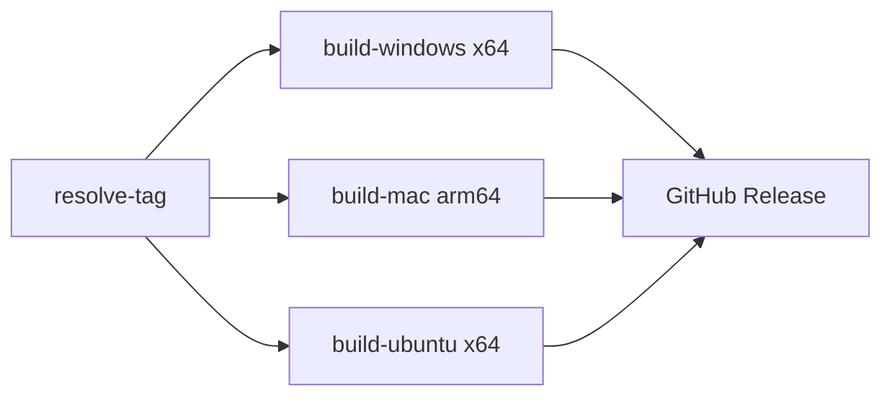

# CI/CD Pipeline — Phanle

> GitHub Actions | Build: Windows + macOS + Linux | Auto-publish khi tag

---

## Tổng quan workflows

| File | Trigger | Mục đích |
|------|---------|---------|
| `build-all.yml` | push tag `v*` / manual | Build cả 3 platform song song → publish GitHub Release |
| `build-windows.yml` | manual | Build Windows riêng |
| `build-macos.yml` | manual | Build macOS riêng |
| `build-ubuntu.yml` | manual | Build Ubuntu riêng |
| `test.yml` | push / PR → main | Chạy Jest unit tests |
| `deploy-landing.yml` | push main | Deploy landing page |

---

## Build Pipeline (build-all.yml)



### Các bước mỗi job

1. Checkout code
2. Setup Node.js 22.x
3. `npm ci --legacy-peer-deps`
4. `tsc -p tsconfig.electron.prod.json`
5. `vite build`
6. `electron-builder --platform --arch --publish never`
7. Upload artifacts → GitHub Release (nếu publish=true)

**Riêng Ubuntu:** thêm bước build E2EE bridge (Go)

---

## Secrets cần cấu hình

| Secret | Mô tả |
|--------|-------|
| `GITHUB_TOKEN` | Tự động có, dùng để publish release |
| `GH_TOKEN` | Personal Access Token (repo scope) - backup |

---

## Test Pipeline (test.yml)

```yaml
on:
  push:
    branches: [main]
  pull_request:
    branches: [main]

jobs:
  test:
    runs-on: ubuntu-latest
    steps:
      - checkout
      - setup-node 22.x
      - npm ci
      - npm test
```

---

## Release Flow

1. Dev merge PR vào `main`
2. Tạo tag: `git tag v26.7.4 && git push origin v26.7.4`
3. GitHub Actions tự trigger `build-all.yml`
4. 3 job chạy song song (Windows/macOS/Linux)
5. Artifacts upload lên GitHub Releases

**Hoặc:** Manual trigger qua GitHub UI → chọn publish=true, tag tùy ý

---

## Branch Protection (main)

- Require PR trước khi merge
- Require status checks pass (test.yml)
- No direct push
- Dismiss stale reviews

---

## PR Template

File: `.github/pull_request_template.md`

```markdown
## Mô tả thay đổi
<!-- Giải thích ngắn gọn đã làm gì -->

## Loại thay đổi
- [ ] feat: Tính năng mới
- [ ] fix: Sửa bug
- [ ] chore: Cấu hình, dep
- [ ] docs: Tài liệu
- [ ] refactor: Refactor code
- [ ] test: Test

## Checklist
- [ ] Code chạy đúng
- [ ] Unit test pass
- [ ] Không có console.error không mong muốn
- [ ] Tài liệu cập nhật (nếu cần)

## Related issue
Closes #
```

---

## Issue Templates

### Bug Report
```markdown
**Mô tả bug:** 
**Bước tái hiện:**
**Kết quả mong đợi:**
**Kết quả thực tế:**
**Môi trường:** (OS, version app)
**Screenshot/log:**
```

### Feature Request
```markdown
**Tính năng muốn thêm:**
**Lý do / use case:**
**Giải pháp đề xuất:**
**Priority:** P0/P1/P2/P3
```
